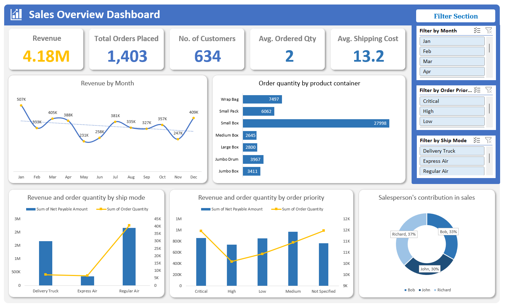
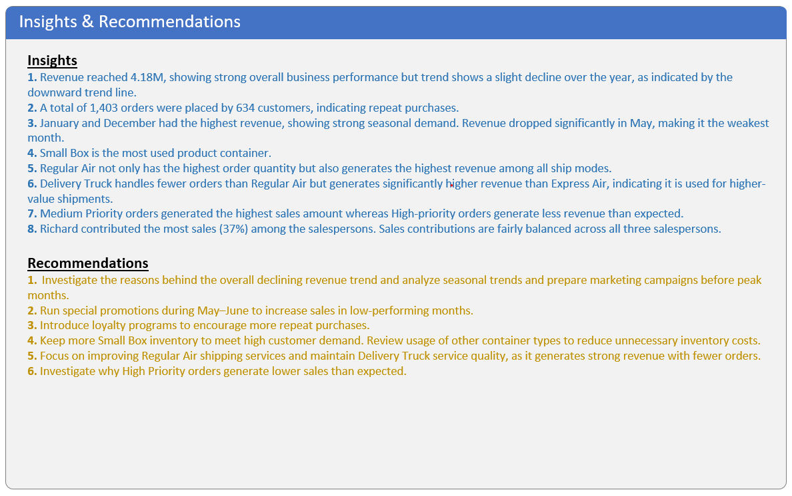

# 📊 Sales Overview Dashboard | Microsoft Excel

An interactive **Microsoft Excel dashboard** that provides a comprehensive overview of sales performance. It enables users to analyze revenue, orders, customers, shipping methods, order priorities, and salesperson performance through interactive visualizations.

---

## 📌 Project Overview

This dashboard was built using **Microsoft Excel** to transform raw sales data into meaningful business insights. It leverages **PivotTables, PivotCharts, Slicers,** and **advanced Excel features** to create an interactive reporting solution.

---

## ✨ Dashboard Features

- Executive KPI Cards
- Interactive Slicers
- Monthly Revenue Trend Analysis
- Product Container Analysis
- Shipping Mode Performance
- Order Priority Analysis
- Salesperson Contribution Analysis
- Clean and User-Friendly Dashboard Layout

---

## 🛠️ Dashboard Development Process

#### Step 1 — Data Collection

- Import the sales dataset into Excel.
- Review the dataset for completeness and accuracy.

#### Step 2 — Data Preparation

- Convert data into an Excel Table
- Create helper columns where necessary
- Organize the dataset for PivotTables

#### Step 3 — Create Pivot Tables

Build PivotTables to summarize:

- Revenue
- Orders
- Customers
- Shipping performance
- Product containers
- Salesperson contribution

#### Step 4 — Create Pivot Charts

Develop interactive charts including:

- Line Chart
- Clustered Column Chart
- Bar Chart
- Doughnut Chart

#### Step 5 — Build KPI Cards

Create summary cards for:

- Revenue
- Total Orders
- Number of Customers
- Average Ordered Quantity
- Average Shipping Cost

#### Step 6 — Add Interactivity

Use Slicers for:

- Order Priority
- Ship Mode
- Month

Connect slicers to all PivotTables for a fully interactive dashboard.

#### Step 7 — Dashboard Design

- Align visuals neatly
- Apply a consistent color theme
- Format charts and KPI cards
- Create an executive-friendly layout

---

## 📊 Business Insights

- **Strong Revenue Performance:** The business generated **$4.18M** in total revenue, reflecting strong overall sales performance.

- **Healthy Customer Engagement:** A total of **1,403 orders** were placed by **634 customers**, indicating a healthy level of repeat purchases.

- **Seasonal Sales Peaks:** **January** and **December** recorded the highest revenue, suggesting strong seasonal demand during these months.

- **Weak Sales Period:** Revenue declined significantly in **May**, making it the lowest-performing month of the year.

- **Most Popular Product Container:** **Small Box** was the most frequently used product container, indicating the highest customer demand.

- **Preferred Shipping Method:** **Regular Air** was the most commonly selected shipping mode, making it the preferred delivery option for customers.

- **Order Priority Performance:** **Medium Priority** orders generated the highest revenue, while **High Priority** orders contributed less revenue than expected.

- **Salesperson Contribution:** **Richard** contributed the largest share of total sales (**37%**). Overall, sales contributions were relatively balanced across all three salespersons.

---

## 💡 Recommendations

- **Boost Low-Performing Months:** Launch targeted promotions and marketing campaigns during **May–June** to increase sales during slower periods.

- **Optimize Inventory Management:** Maintain higher inventory levels for **Small Box** containers while reviewing demand for other container types to reduce unnecessary inventory costs.

- **Enhance Shipping Services:** Continue improving the **Regular Air** shipping service to maintain customer satisfaction and support its high demand.

- **Review High-Priority Orders:** Investigate why **High Priority** orders generate lower-than-expected revenue and identify opportunities to improve their performance.

- **Strengthen Customer Loyalty:** Introduce loyalty or rewards programs to encourage repeat purchases and improve customer retention.

- **Prepare for Seasonal Demand:** Analyze historical sales patterns and plan inventory, staffing, and marketing campaigns ahead of peak months such as **January** and **December**.

---

## 📷 Dashboard Preview

  

  

---

#### ⭐ If you found this project helpful, consider giving it a star!